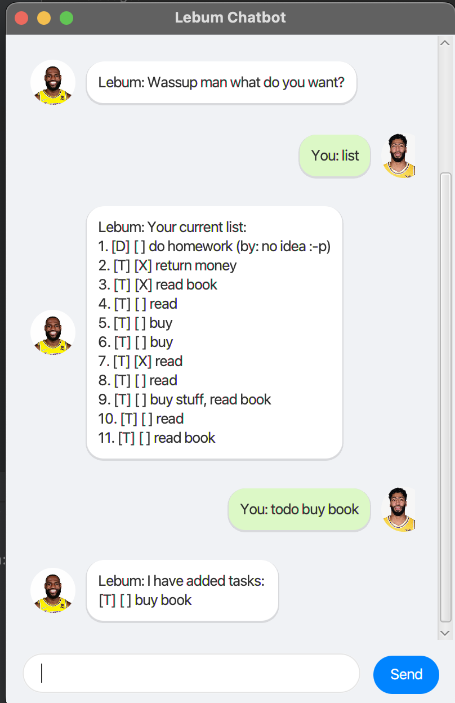

# Lebum Chatbot - Your GOAT Task Management GM

Lebum is a desktop chat-based task manager that helps you keep track of your todos, deadlines, and events. With its friendly chat interface, managing tasks feels like chatting with a friend!

## Quick Start

1. Ensure you have Java 11 or above installed
2. Download the latest version of Lebum from [here]
3. Double-click the file to start the application
4. Type `hi` or `hey` to start chatting with the GOAT!

## Features

### Task Management

#### 1. Adding Tasks

##### To-Do Tasks
* Format: `todo TASK_DESCRIPTION`
* Example: `todo read book`
* Adds a simple task without any date/time

##### Deadlines
* Format: `deadline TASK_DESCRIPTION /by DATE_TIME`
* Example: `deadline submit report /by 2024-02-20 23:59`
* Adds a task with a specific deadline
* Date format: `yyyy-MM-dd` or `yyyy-MM-dd HH:mm`

##### Events
* Format: `event TASK_DESCRIPTION /at DATE_TIME`
* Example: `event team meeting /at 2024-02-21 14:00`
* Adds an event at a specific time
* Date format: `yyyy-MM-dd` or `yyyy-MM-dd HH:mm`

#### 2. Viewing Tasks

* Command: `list`
* Shows all your tasks with their status and details
* Tasks are numbered for easy reference

#### 3. Marking Tasks

* Format:
    * Single task: `mark TASK_NUMBER`
    * Multiple tasks: `mark TASK_NUMBER,TASK_NUMBER,...`
* Examples:
    * `mark 1`
    * `mark 1,2,3`
* Marks the specified task(s) as done
* Use `unmark TASK_NUMBER` or `unmark TASK_NUMBER,TASK_NUMBER,...` to mark tasks as not done
* Examples:
    * `unmark 1`
    * `unmark 2,4,6`

#### 4. Deleting Tasks

* Format:
    * Single task: `delete TASK_NUMBER`
    * Multiple tasks: `delete TASK_NUMBER,TASK_NUMBER,...`
* Examples:
    * `delete 2`
    * `delete 1,3,5`
* Removes the specified task(s) from your list

### Search and Find

* Format: `find KEYWORD`
* Example: `find report`
* Shows all tasks containing the keyword
* Search is case-insensitive

### Exiting the Program

* Command: `bye`
* Saves your tasks and closes Lebum

## Command Summary

| Command | Format | Example |
|---------|---------|---------|
| Add Todo | `todo TASK` | `todo read book` |
| Add Deadline | `deadline TASK /by DATE_TIME` | `deadline report /by 2024-02-20 23:59` |
| Add Event | `event TASK /at DATE_TIME` | `event meeting /at 2024-02-21 14:00` |
| List | `list` | `list` |
| Mark | `mark NUMBER[,NUMBER,...]` | `mark 1` or `mark 1,2,3` |
| Unmark | `unmark NUMBER[,NUMBER,...]` | `unmark 1` or `unmark 2,4,6` |
| Delete | `delete NUMBER[,NUMBER,...]` | `delete 2` or `delete 1,3,5` |
| Find | `find KEYWORD` | `find report` |
| Exit | `bye` | `bye` |

## Notes

* The date format must be `yyyy-MM-dd` or `yyyy-MM-dd HH:mm`
* Task descriptions cannot contain `<`, `>`, `|`, `\`, `^`, or `` ` ``
* Maximum task description length is 100 characters
* Cannot set deadlines or events in the past
* Cannot add duplicate tasks (same description and time)
* All tasks are automatically saved after each command
* When marking, unmarking, or deleting multiple tasks, separate the task numbers with commas (no spaces)